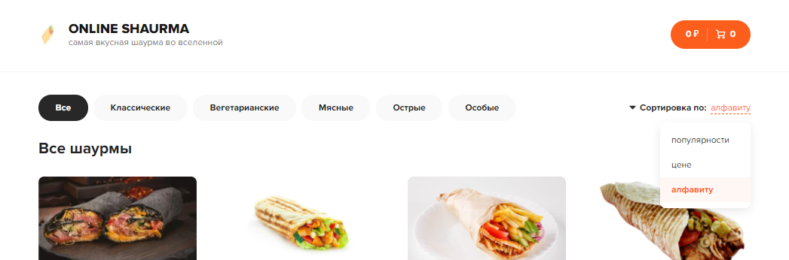
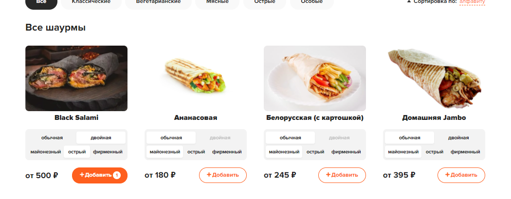
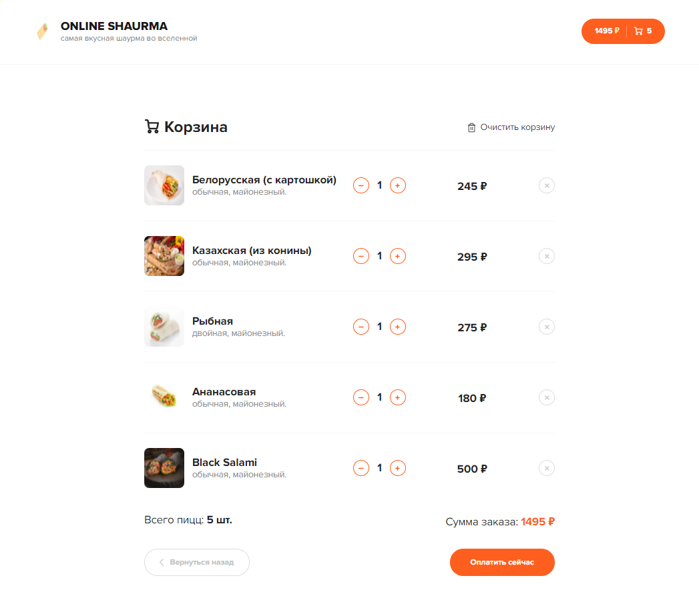
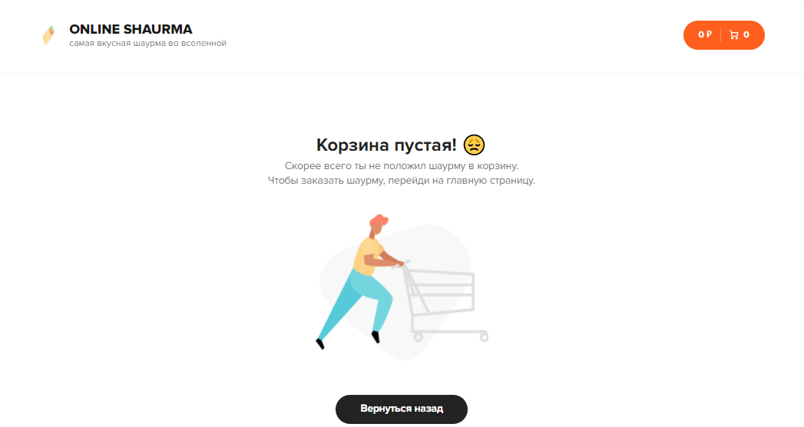

<h1 align="center">Online Shaurma</h1>
<h2 align="center">

<p align="center"></p>

___

## Description

**Shaurma online**

This is a shop for selling shaurma.
Here you can choose the size and sauce for the shaurma and enjoy its taste.

___

## How to use
- **Sort** by price.
<p align="center"></p>

- **Choose** the right size and sauce.

- **Add** product to cart.
<p align="center"></p>

- **Place** an order.
<p align="center"></p>

- **If** you change your mind, you can empty the cart and return to the main page.
<p align="center"></p>

___

## About the project.

### Objectives of the project

- Learn to work with React, Redux and etc.
- In this project I tried to learn work with **react-content-loader**, **react-thunk**.

___

## Project setup
- **Important!**

Before starting the project, make sure that the ports **localhost:3000** and **localhost:3001** are open.

- **Make** sure you have installed **yarn**.

- Run yarn and application on port 3000.
```
yarn
yarn start
```

- Start a fake server (json-sever).
```
yarn server
```
The server will start on port 3001 and will allow you to upload products to the site.

___

## Future scope

Plans for the distant future 

- Add project information to a separate window
- Fix bugs in the cart (order amount on the cart icon)
- Add transition animations
- Add payment
