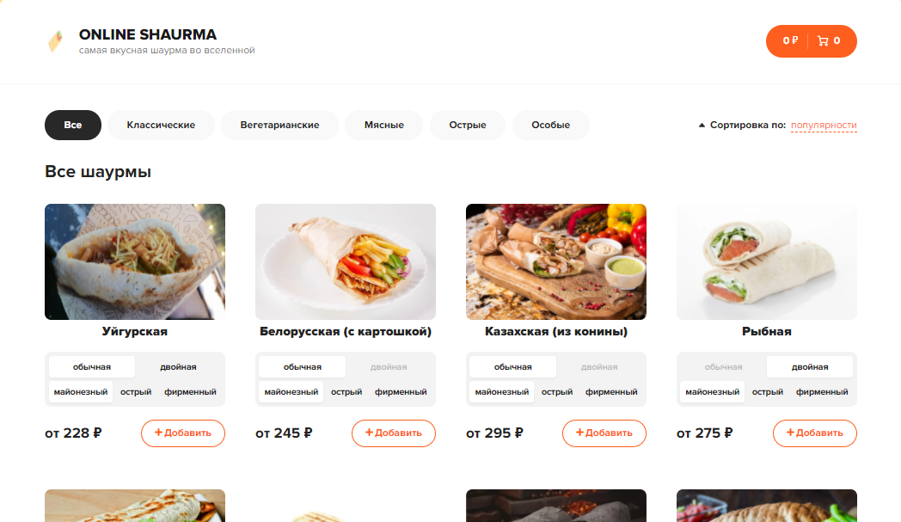

<h1 align="center">PostsApp</h1>
<h2 align="center">

<p align="center"></p>

## Description

**Posts app**

I created this application to practice creating posts.

## How to use
- **Write** your post to the panel.
- **Also** you can download posts from another site

## About the project.

### Objectives of the project

- This is one of the first projects which I did on React.
- In this project I tried to learn work with **async**.

### Bootstrap

- If you encounter problems installing the project, run it with version 4.x.x.
- The app is not compatible with Bootstrap v.5.x.x!

### Async

- If you click on the blue button, then posts from <code>[typicode.com](адрес "https://jsonplaceholder.typicode.com/posts?_limit=5")</code> will be loaded.


## Project setup

```
yarn
yarn start
```

## Future scope

- Draw a more beautiful design
- Local database needs to be added
- Synchronization with Firebase